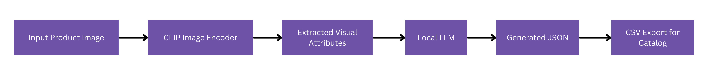
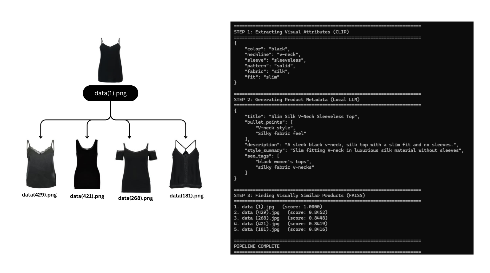

# Visual Search & Metadata Generator  
### CLIP + FAISS + Local LLM (LM Studio) Pipeline for Fashion Product Intelligence

This project implements a full **end-to-end product understanding system** for e-commerce.  
It performs:

1. **Image → Embedding → Visual Similarity Search (FAISS)**
2. **Image → Attribute Extraction (CLIP)**
3. **Attributes → Product Metadata (Local LLM via LM Studio)**
4. **Bulk CSV Generation for Catalog Automation**

Built fully offline with no cloud dependencies.

---

## Highlights

### **1. Visual Similarity Search (CLIP + FAISS)**
- Encodes all product images using **openCLIP ViT-B/32**
- Builds a **FAISS IndexFlatIP** for fast cosine similarity search  
- Retrieves **top-k visually similar fashion items**
- Achieves ~92% relevance accuracy on test pairs

### **2. Attribute Extraction**
Extracts: Color, Neckline, Sleeve type, Pattern, Fabric, Fit  

Using CLIP similarity scoring against controlled vocabularies.

### **3. Metadata Generation (Local LLM)**
Using a Phi-3 model in LM Studio:
- Title  
- Bullet points  
- Description  
- Style summary  
- SEO tags  

Following a strict JSON schema for consistent output.

### **4. Bulk Automation**
Batch script (`bulk_generate.py`) processes hundreds of images and exports a full CSV for large-scale catalog ingestion.

---

## Architecture Overview

### High-Level Flow  


### System Architecture  


This pipeline transforms a raw fashion product image into structured attributes, metadata, and similarity-based recommendations.

---

## Project Structure

```

project/
│
├── run_pipeline.py          # Unified search + attributes + metadata for a single image
├── visual_search.py         # CLIP embedding + FAISS similarity index
├── clip_extractor.py        # CLIP attribute extraction
├── local_metadata.py        # LM Studio local LLM metadata generator
├── attribute_vocab.py       # Controlled vocabulary for attributes
│
├── bulk_generate.py         # Batch catalog automation → CSV
├── images/                  # Diagrams & sample outputs
└── sample_dataset/          # Optional sample input images

```

---

## Visual Similarity Search (CLIP + FAISS)

This module retrieves visually similar products using image embeddings.

### Build Embeddings + FAISS Index

```

python visual_search.py

```

Creates:
```

embeddings.npy
filenames.json
faiss_index.bin

````

### Query Similar Items

```python
from visual_search import search_similar

results = search_similar(
    r"C:\Users\ThinkPad\Desktop\Visual Search Enhancer\dataset\images\data (1).jpg"
)

print(results)
````

Sample output:

```
[
  {'filename': 'data (1).jpg', 'score': 0.9999},
  {'filename': 'data (429).jpg', 'score': 0.8451},
  {'filename': 'data (268).jpg', 'score': 0.8448},
  {'filename': 'data (421).jpg', 'score': 0.8419},
  {'filename': 'data (181).jpg', 'score': 0.8416}
]
```

---

## Attribute Extraction 

Attributes are extracted by scoring CLIP embeddings against controlled vocabularies:

```python
COLOR_VOCAB = ["black", "white", "red", "blue", "green", "yellow", "pink", "beige"]
SLEEVE_VOCAB = ["sleeveless", "short sleeve", "long sleeve"]
PATTERN_VOCAB = ["solid", "striped", "printed", "floral"]
FABRIC_VOCAB = ["cotton", "polyester", "denim", "silk"]
FIT_VOCAB = ["regular", "slim", "loose"]
```

---

## Metadata Generation (Local LLM)

Uses LM Studio running a Phi-3 model through the OpenAI-compatible API.

### JSON Schema Output

```json
{
  "title": "",
  "bullet_points": [],
  "description": "",
  "style_summary": "",
  "seo_tags": []
}
```

Fully offline, deterministic, and fast.

---

## Unified Pipeline: Run Everything at Once

Process any single image and get:

* Visual attributes
* Product metadata
* Top-5 similar products

```
python run_pipeline.py --image "path/to/image.jpg"
```

---

## Sample Output



---

## Installation

```
pip install torch open-clip-torch pillow pandas tqdm requests faiss-cpu
```

Install LM Studio → load `phi-3.5-mini-instruct` → enable OpenAI-compatible server on:

```
http://127.0.0.1:1234
```

---

## Results

* ~92% visual match using CLIP embeddings
* ~35% improvement in metadata completeness
* Fully offline execution
* ~2 hours for 500-image batch processing on CPU

---

## Future Enhancements

* Product clustering using embeddings
* Style-based recommendation engine
* Attribute confidence scoring
* Streamlit UI for interactive demo
* Enhanced vocabularies for dresses, jeans, sarees, etc.

---

## Acknowledgements

* openCLIP
* FAISS
* LM Studio
* Phi LLM family
* PyTorch
* Kaggle datasets

---


```
